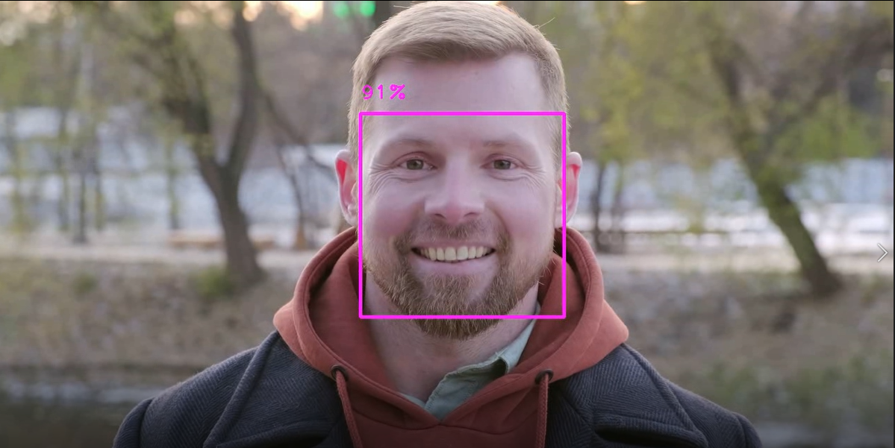
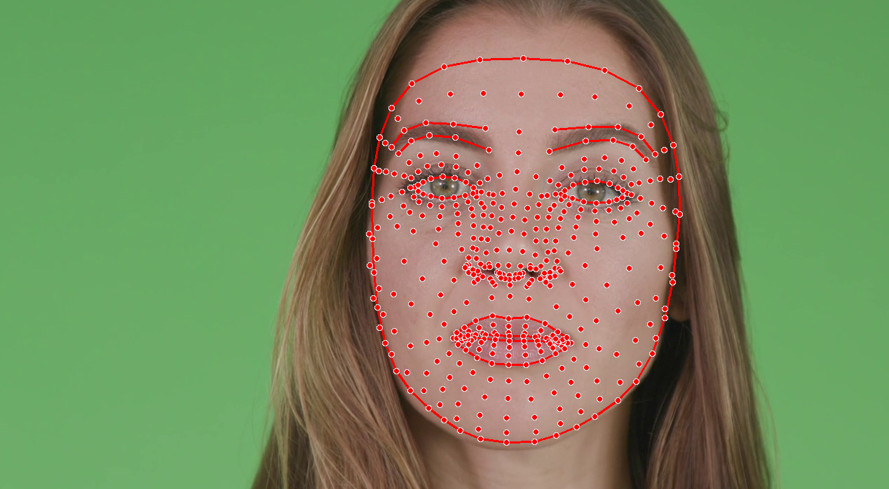

# MediaPipe Kullanarak İleri Seviye Bilgisayarla Görü 

Mediapipe, Google tarafından oluşturulan makine öğrenimi çözümleri oluşturmak kullandığımız açık kaynaklı bir frameworktür. 
MediaPipe modüler yapısı sayesinde bize kullanımı kolay ve hızlı uygulanabilir bir yapı sunuyor. Bir çok platformda kullanılmasıda büyük bir avantaj sağlıyor.  
Aşağıdak resimde mediapipe ile oluşturabileceğimiz bazı modeller bulunuyor. Bunları ayrıca incelemek için https://google.github.io/mediapipe/ adresini ziyaret edebilirsiniz. 
  

Burada bulunan çözümleri kullanarak bizde Hand,Face Detection, Face Mesh, Pose modelleri oluşturacağız. Bunları daha sonra kullanmak için modüler bir yapı kullanacağız. Adım adım ilerleyelim.  

## Kullanacağımız Kütüphaneler
MediaPipe kütüphanesini yüklemek için terminale "pip install mediapipe" yazabilirsiniz. 
Bununlar birlikte videolardan üzerinde yapacağımız işlemleri de opencv kütüphanesi ile yapacağız. 
OpenCV kurmak içinde pip install opencv-python yazabilirsiniz.

# Hands
  
Elin şeklini ve hareketleri anlamak için bu modülü kullanacağız. MediaPipe Hands birden fazla modelin birlikte çalışması ile oluşuyor. Burada modellerden biri *Palm Detection* diğeri *Hand Landmarks* . Palm Detection modeli elin bulunduğu kısmı keser ve Hand Landmarks modeli elde bulunan noktaları detect etmeye çalışır. Elin croplanması sayesinde Landmark modeli daha başarı bir sonuç ortaya koyar.  
Aşağıdaki resimde elde tespit edilecek landmarkları görebilirsiniz. 
  

Modüler bir yapı oluşturmak istediğimi söylemiştim. Bu sebeple HandTracking adında bir sınıf oluşturalım. Bunu sınıf içerisinde "__init__" metodu ile alacağımız parametreleri belirtelim. Bu parametlerelin ayrıntılı açıklamasını "https://google.github.io/mediapipe/solutions/hands.html" adresinden öğrenebilirsiniz.  

Öncelikle hands adında bir değişken oluşturalım bu değişken ile hands sınıfındaki metotlara erişebileceğiz. Daha sonra elde ettiğimiz landmarkları çizim yaparken kullanmak için mp_drawing nesnesini oluşturuyoruz.
  

find() adında image ve draw parametleri alan bir fonksiyon oluşturalım. Burada image değişkeni videodan aldığımız frameleri temsil ediyor, draw değişkenine ise default olarak True değerini verdik, video üzerinde çizim göstermek istemezsek bunu False yapabiliriz.  

MediaPipe alınan imagelerin RGB formatında olmasını istiyor. Biz Opencv ile okuduğumuz videoları BGR olarak okuyoruz. Bu sebeple cvtColor metodu ile imagei RGB ye çeviriyoruz.
Oluşturduğumuz hands nesnesinin process metodunu kullarak handtracking işlemini başlatıyoruz. Buradan aldığımız bilgileri result değişkeninde tutuyoruz. Result değişkeni içerisinde detect edilen eller ve bu ellerin landmarkları bulunuyor.For döngüsü ile detect edilen ellerin landmarklarını alıyoruz. Tüm bu aldığımız bilgileri mp_drawing objesinin draw_landmarks metodunu kullanarak çizdiriyoruz. Burada mp_hans.HAND_CONNECTIONS ile landmarklar arasında çizgiler çekiyoruz. Daha sonra kullanmak için img döndürüyoruz. 
  

# Hand Videos
Aşağıdak videolarda sonuçları inceleyebilirsiniz. 
<video width="320" height="240" src="videos/hand1.mp4" type="video/mp4"/> 
<video width="320" height="240" src="videos/hand1.mp4" type="video/mp4"/> 

# Pose
  

Videolar kullanarak pose tahmini ile yapılan egzersizlerin doğruluğunun kontrol edilmesi, işaret dili, vucut hareketlerimizi kullanabileceğimiz uygulamalar gibi bir çok alanda bize faydası olabilir. MediaPipe kütüphanesinde bulunan Pose sınıfıda bunu bizim için oldukça kolay hale getiriyor. 33 farklı 3 boyutlu landmarkı pose modelini kullanarak tespit edebiliyoruz.   

  

Yine Hands modelinde olduğu gibi 2 farklı model bulunuyor modellerden biri landmarkların tespit edilmesi biri pose estimation yapılacak insanın tespit edilmesinde kullanıyor. Croplanan image sayesinde landmarkların yüksek doğruluk oranıyla detect edilmesi sağlanıyor.  

Pose modelinde de daha sonra kullanmak için bir sınıf oluşturacağız. Modules klasörü altında Pose adında bir python dosyası oluşturalım. Bu python dosyasının içersinde "PoseDetection" adında bir sınıf oluşturalım. Burada bir çok parametre bulunuyor. Şimdilik bu parametreleri değiştirmemize gerek yok. Parametreler hakkında daha fazla bilgi almak için mediapipe sitesini ziyaret edebilirsiniz.
  

Hand modeline çok benzer işlemler uygulayarak find metodumuzu oluşturuyoruz. Landmarkların birleşmesi için mp_pose.POSE_CONNECTIONS parametresini de kullanmayı unutmayalım.  
  

VIDEO

# Face Detection 
  

Mediapipe ile face detection yapmakta oldukça hızlı ve başarılı görünüyor. Yüzde bulunan 6 farklı landmarkın tespit edileside ayrıca sağlanıyor. Bunun yanında bounding box oluşturarak yüzü bir kare içerisine alarak detection işlemini gerçekleştirebiliyoruz. Ayrıca birden fazla yüzün tespit edilemside sağlanıyor. 

Burada da aynı hand ve pose kısımlarında ki detection ve drawing objelerimizi oluşturuyoruz. Yine bahsettiğim gibi modüler bir yapı olması için FaceDetectionC adında bir class oluşturdum. 
   

Öncelikle results.detection ile detection yapılmışmı bunu kontrol edelim. Daha sonra detect edilen yüzleri for döngüsü ile geziyoruz. Yüzün sınırlarına bir kare çizmek için bounding_box bilgisini çekiyoruz. Daha sonra kendi bounding boxımızı oluşturmak için detection dan aldığımız bilgileri imagein height ve widht değerleri ile çarpıyoruz. (detection yapılırken x,y,widht,height değerleri 0 ile 1 arasında veriliyor. Konumların tespit etmek için image'in shape değerleri ile çarpıyoruz.) Aldığımız bbox bilgisi ile cv2.rectangle ile bir kare çiziyoruz. Detection objesi içerisinde bulunan score bilgisinide putText metodu ile ekrana basabiliriz.   
   
# VIDEO

# FACE MESH 
  

Face Mesh modelini kullanarak yüzde bulunan 468 3 boyutlu noktayı tespit edebiliz. Burada aldığımız landmarklar ile bir çok işlem gerçekleştirebiliriz. Örneğin son zamanlarda çok kullanılan kamera filtrelerini bu sayede kolayca oluşturabiliriz. 
 

Yine aynı şekilde bir FaceMeshC adında bir sınıf oluşturalım. Bunun init metodu içerisinde gerekli parametreleri alalım. Aynı şekilde process işlemini başlatmak için gereken objeleri oluşturalım. 
  
Diğer modellerde yaptığımız gibi mp_draw nesnesini kullanarak çizim işlemini yapalım. 
  
# VIDEO
SONUC
Tüm bunları kullanmak için mp_models.py adında bir python dosyası oluşturalım. Burada hangi modeli kullanmak istediğimizi arg olarak verebiliriz. Örn : python mp_models.py hand ile hand detector çalışır ve gönderdiğimiz video üzerinde detect işlemi yapılır daha sonra bu video processed_videos klasörüne kaydedilir. 
   

which() metoduna argument olarak hangi model adı ilgili sınıftan bir obje oluşturulur. Bu detector objesi ve video show() metoduna gönderilir. 

   

show metodunda ise opencv de buluanan VideoCapture metodu ile okunur. İlgili sınıfında find metoduna image gönderilir detection işlemi yapılan ve dönen video kaydedilir. 

